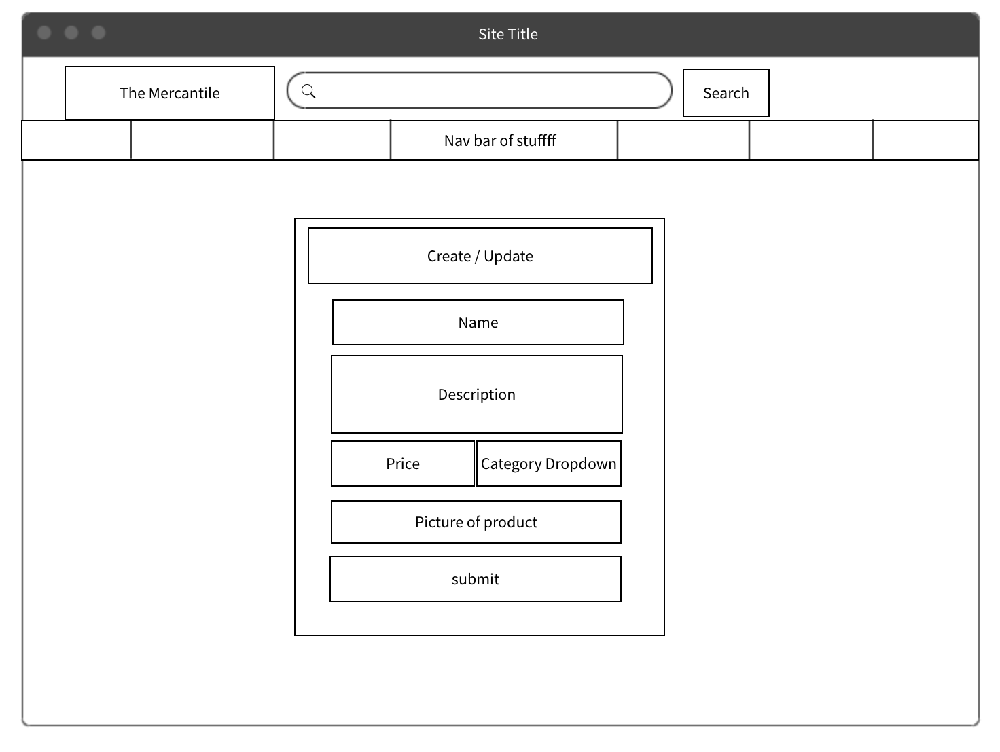

# The Mercantile
---
### Description
This app is designed to allow merchants to post their wares for potential buyers or curious consumers no matter where they are! Users will be able to see all listings, create a new entry, read a specific listing, update an existing, and delete postings.
### Technologies Used
- Python
- Django
- PostSQL
- JavaScript/HTML/CSS
- React
- Thunder Client
- DrawSQL
- Trello
- Render
- Netlify

### Routes & Components
- App --> Header 
- App --> Outlet 
- Outlet -- "/" --> Index
- Outlet -- "/wares/:id" --> Show
- Outlet -- "/wares/create" --> createAction
- Outlet -- "/wares/update/:id" --> updateAction
- Outlet -- "/wares/delete/:id" --> deleteAction

| Route | Method | Loader | Action | Function |
|-------|---------|--------|--------|----------|
| /wares| GET | Index | | Displays all products for sale|
| /wares/:id | GET | Show | | returns a single job posting by id |
| /wares | POST | | Create | Creates a new item for sale|
| /wares/:id | PUT | | Update | Updates an existing posting based on id |
| /wares/:id | DELETE | | Delete | Deletes a product by id |

### Planning
[Trello Board](https://trello.com/invite/b/qKhSytRv/ATTIc5cb81e12a364ff41982381c19411aa6789E462E/the-mercantile)

### Model

### Wireframe

### Link to Backend

### Link to Frontend
